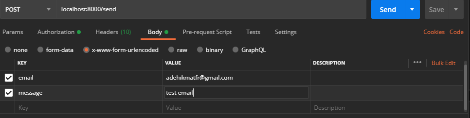
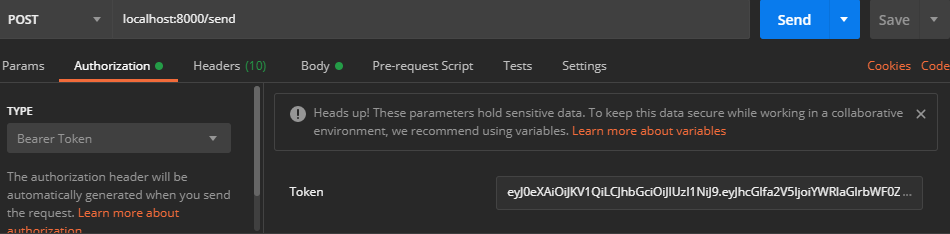

### SEND EMAIL SERVICE

open source code aplikasi untuk mengirim data ke email dari antrean. pada kesempatan kali ini saya menggunakan arsitektur microserver dimana service recive email ini tidak ketergantungan dengan service send email . arsitektur seperti ini akan menghemat waktu saat user melakukan pengiriman email dan juga jika salah satu service terkendala mudah memanagement dan memperbaiki service apalagi jika error di bagian service recive email , email yang terkirim dari service send email akan aman dikarnakan saya menggunakan teknologi rabbitmq untuk menghendel antran dari service send email.
<br/>

## available piture

- queque send
- send email
- token

## Require

- php v.7+
- composer
- git (optional)
- RabbitMQ
- database SQL

## How to use

jangan lupa untuk mengatur configurasi .env , di sini saya menggunakan mysql dikarnakan db yang terinstal adalah dbmysql. untuk yang menggunakan postresql tidak masalah tinggal mengatur connectionnya saja pada .env . jangan lupa membuat database dan buat table bernama send_email yang fildnya email dan message.

1. Clone Project

```
$git clone https://github.com/adehikmatfr/service-email.git
```

2. Install plugin

```
$cd service-email
$compouser install
```

3. Run Project

```
$php -S localhost:8000
```

## API REFERENCE

<table>
    <tr>
    <th>Method</th>
    <th>Auth</th>
    <th>URL</th>
    </tr>
    <tr>
    <td>GET</td>
    <td>-</td>
    <td>localhost:8000/token</td>
    </tr>
    <tr>
    <td>POST</td>
    <td>Bearer</td>
    <td>localhost:8000/send</td>
    </tr>
</table>

### EXAMPLE TEST

Notice : pastikan anda telah menjalankan RabbitMQ .<br>
jika stap yang anda lakukan sesuai maka akan seperti ini :

1. run service <br/>
   

2. postman send data <br/>
   

3. get token <br/>
   

4. use bearer <br/>
   

5. response <br/>
   

jika stap yang di lakukan sesuai maka antran sudah terkirim ke rabbitmq . untuk recivernya anda bisa mendownload source code dari link ini
[https://github.com/adehikmatfr/service-recive-email.git](service-send-email) <br>

### Join with me :

[][youtube]
[][linkedin]
[][instagram]

<br />

[linkedin]: https://www.linkedin.com/in/adehikmat
[youtube]: https://www.youtube.com/channel/UCpZ-2cuPYGKO-LSR2YHTrAg/
[instagram]: https://www.instagram.com/adehikmat_fr/
[facebook]: https://www.facebook.com/adehikmat.fanzipauzan
